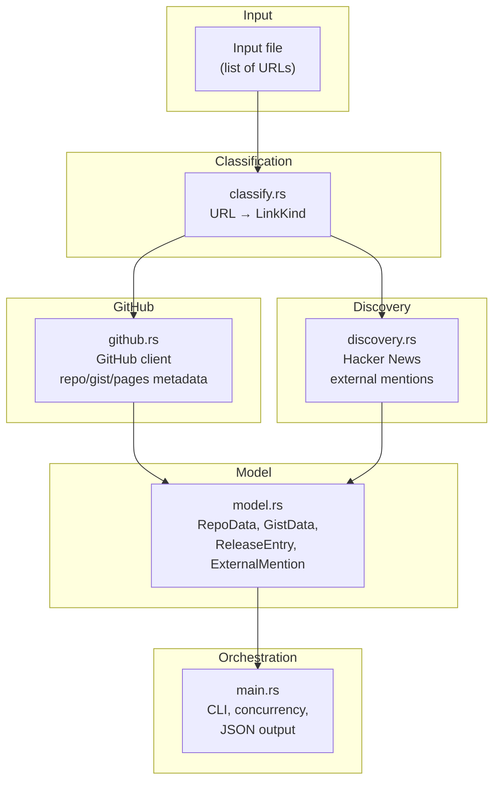
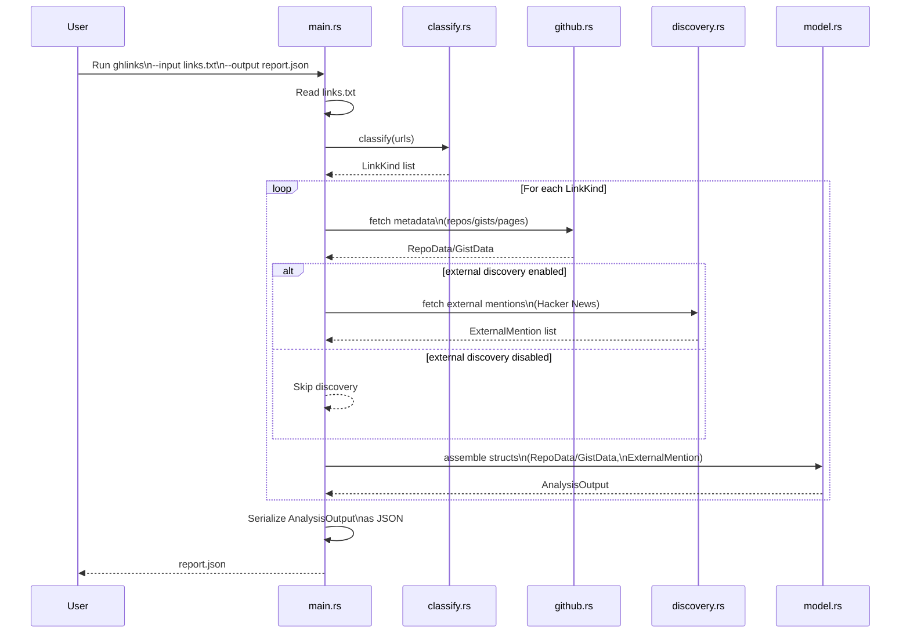
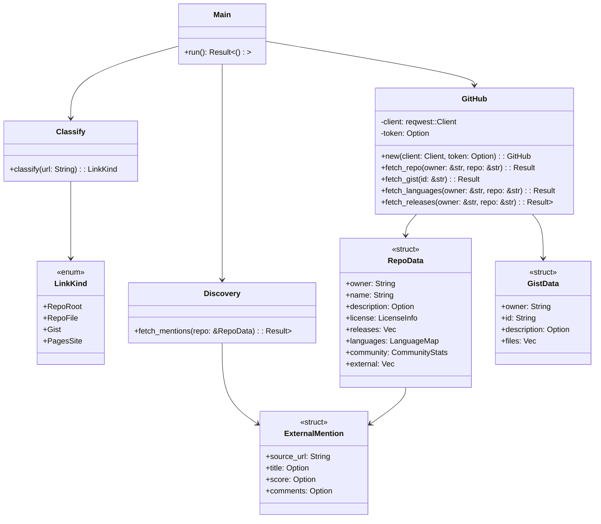
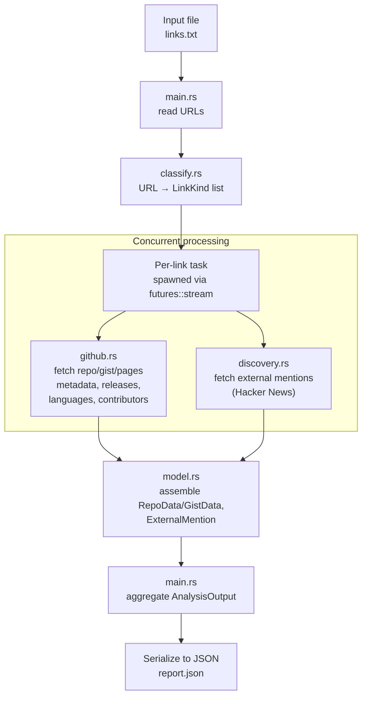

# ghlinks Architectural Diagrams

**Mermaid diagrams are the canonical sources**; using `mermaid-cli` or an online Mermaid renderer, you can produce both SVG and PNG artifacts from each.

Diagram labels are "Mermaid‑safe" (no HTML tags), using `\n` for multi-line text.

## 1. Architecture diagram (canonical)



This version contains:
- No HTML tags  
- No unsupported characters  
- Only Mermaid‑safe multi‑line labels  

**The Mermaid diagram above (`flowchart TD`) is the canonical source**; using `mermaid-cli` or an online Mermaid renderer, you can produce both SVG and PNG artifacts from it.

---

*ASCII architecture diagram (quick visual)*

```text
                +------------------+
                |   Input File     |
                |  (list of URLs)  |
                +---------+--------+
                          |
                          v
                +------------------+
                |    classify.rs   |
                |  URL → LinkKind  |
                +---------+--------+
                          |
          +---------------+----------------+
          |                                |
          v                                v
+------------------+             +------------------+
|    github.rs     |             |  discovery.rs    |
| GitHub metadata  |             | External mentions|
+--------+---------+             +--------+---------+
         |                                |
         +---------------+----------------+
                         |
                         v
                +------------------+
                |    model.rs      |
                |  Structured data |
                +---------+--------+
                          |
                          v
                +------------------+
                |    main.rs       |
                | JSON output file |
                +------------------+
```

---

## 2. Sequence diagram (end‑to‑end run)



---

*ASCII sequence / data flow diagram (quick visual)*

```text
User
 |
 | run ghlinks --input links.txt --output report.json
 v
main.rs
 |
 | read links.txt
 v
classify.rs
 |
 | classify each URL → LinkKind
 v
main.rs
 |
 | spawn concurrent tasks
 v
github.rs ----------------------+
 |                              |
 | fetch metadata               |
 | fetch releases               |
 | fetch languages              |
 | fetch contributors           |
 +------------------------------+
 |
 v
discovery.rs (optional)
 |
 | fetch external mentions
 v
main.rs
 |
 | assemble model structs
 v
model.rs
 |
 | serialize to JSON
 v
report.json
```

---

## 3. Class diagram for Rust modules (conceptual)



---

## 4. Pipeline diagram showing concurrency and data flow



---

You can put each diagram in its own `.mmd` file (e.g., `architecture.mmd`, `sequence.mmd`, `classes.mmd`, `pipeline.mmd`) and render them with `mmdc` to PNG/SVG as needed.

For example, the following will render cleanly:

```
mmdc -i architecture.mmd -o architecture.png
mmdc -i architecture.mmd -o architecture.svg
```
